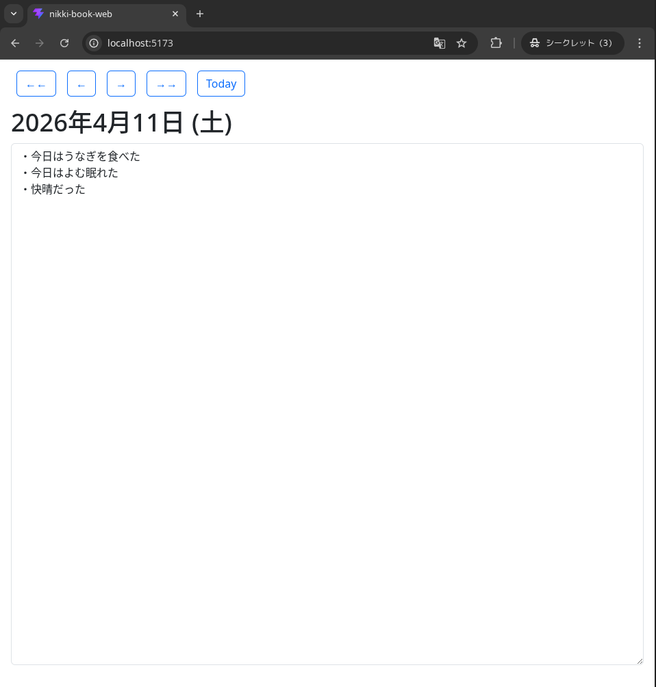

<div align="center">

# nikki-book-web

fastapi+vite+reactで書かれた日記帳Webアプリケーション



<br>
<br>
</div>


## 特徴
* 起動すると、今日の日記入力画面が開くので、すぐに日記を書き始められる※1
* 画像ビューワーのように、日記を見返せる
* これは、[PenguinCabinet/nikki-book](https://github.com/PenguinCabinet/nikki-book)をベースにWebアプリケーションにしたものです


> [!NOTE]
> ※1 エクスプローラとメモ帳で同等のことを行うと、
> 
> 1. 日記を保存しているディレクトリをエクスプローラで開く
> 2. その日の日記のテキストファイルを作り
> 3. そのテキストファイルをメモ帳で開く
> 
> という3ステップが必要になる。

## ローカルで立ち上げる方法
### Backend
```
cd backend
python3 -m venv venv
source venv/bin/activate
pip install -r requirements.txt
fastapi dev
```

### Frontend
```
cd frontend
npm install
npm run dev
```

## デプロイ
### Backend
お好きなVPSで動かすことができます。工夫すれば、Google Cloud Runなどでも動かせると思います。データベースはSQLiteを使っています。
[VPSにDeployする際、この記事が参考になりました。](https://qiita.com/goro8/items/0b0cd89f46452034c40b)
#### 設定方法
```
touch .env
```
`openssl rand -hex 32`を実行し、.envにNIKKI_BOOK_SECRET_KEYを設定してください
```
NIKKI_BOOK_SECRET_KEY=
```
backend/main.pyのCORSMiddlewareを編集し、allow_originsにフロントエンドURLを設定してください。

### Frontend
Cloudflare PagesやVPSで動かすことができます。

## ✍ Author

[PenguinCabinet](https://github.com/PenguinCabinet)

